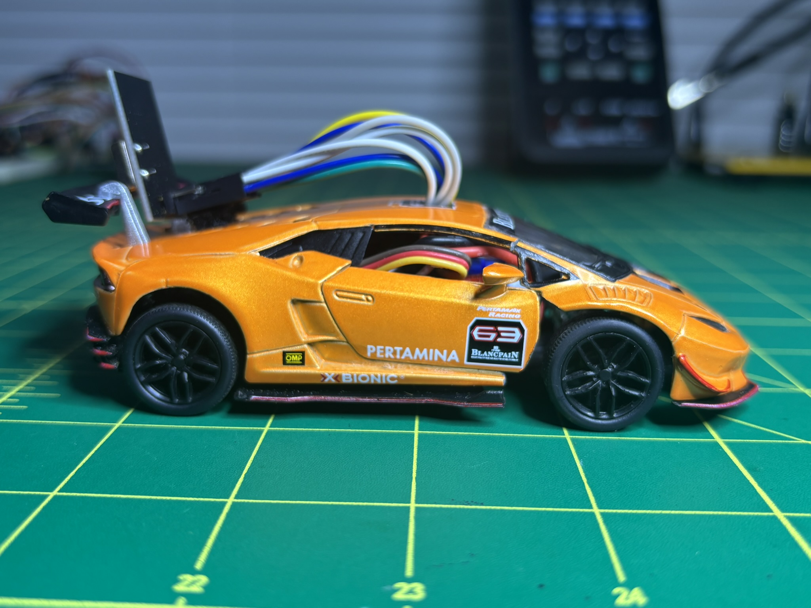
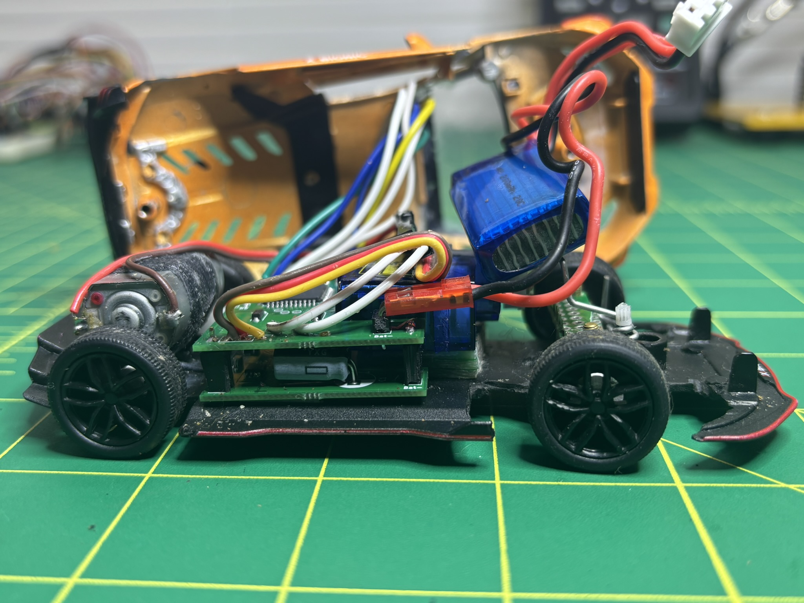
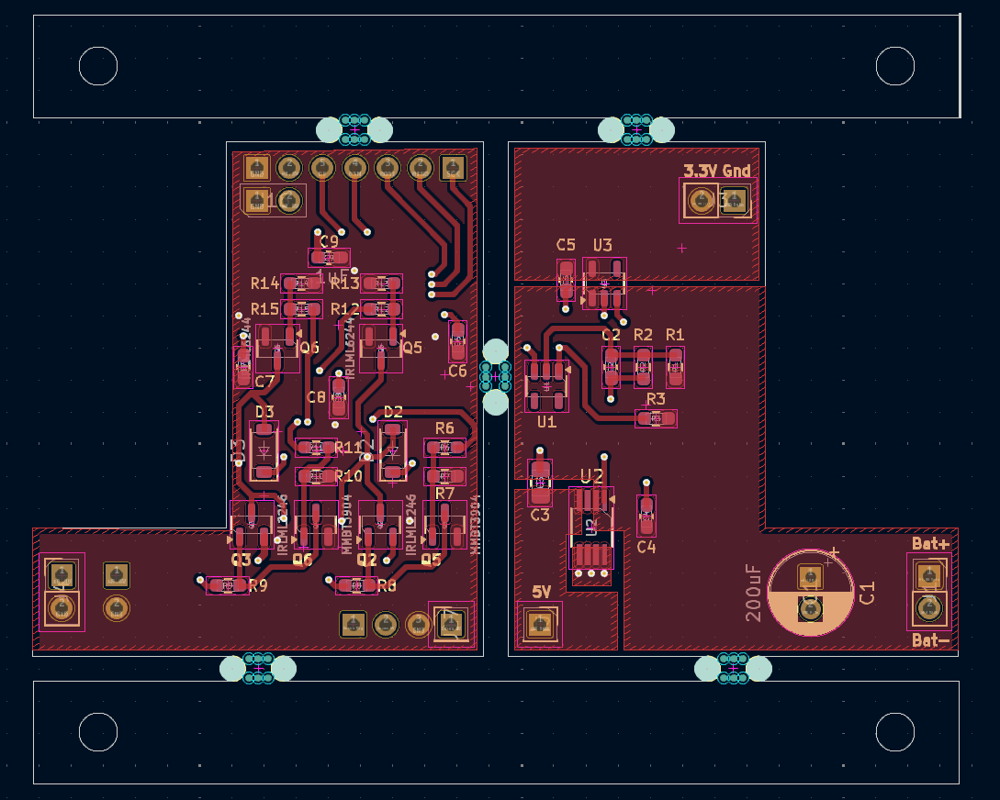
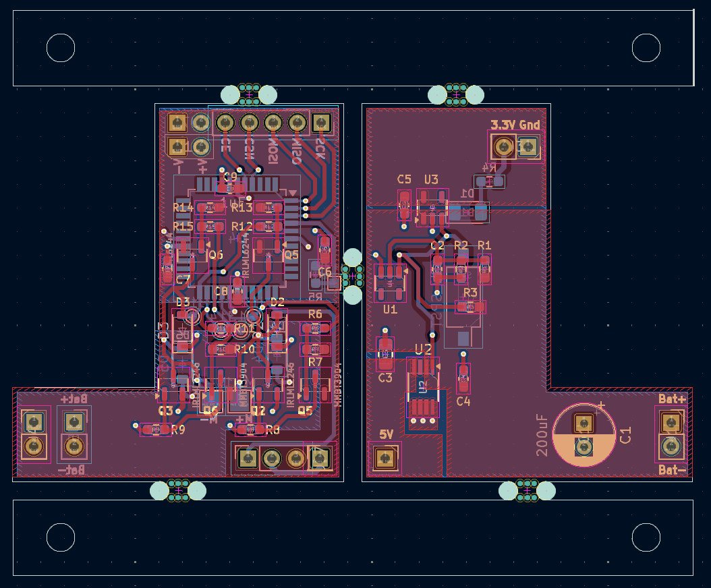
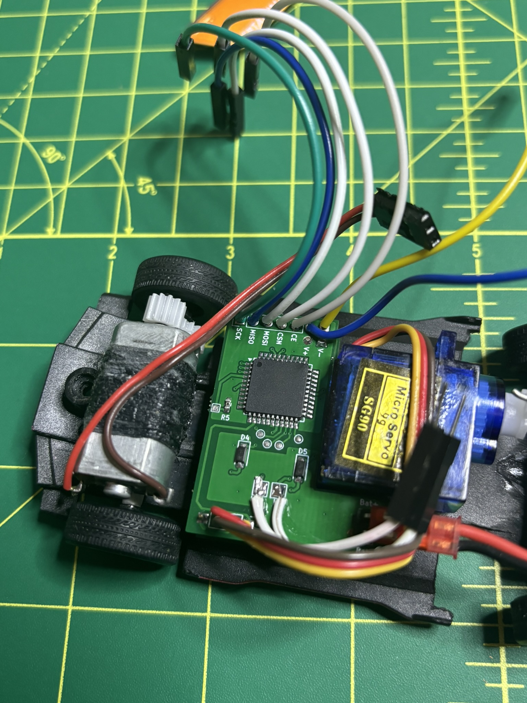
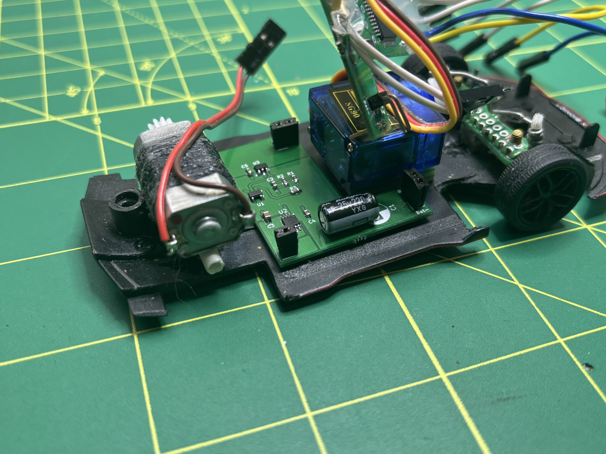
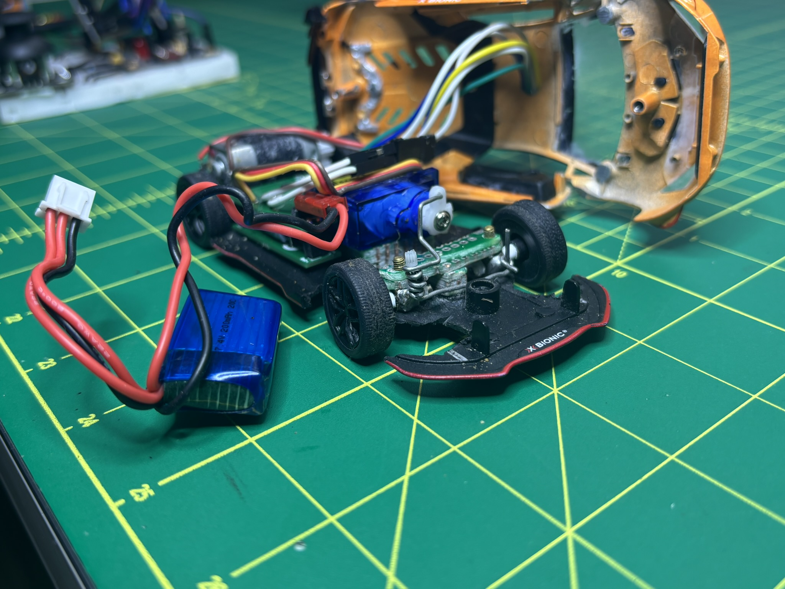

# RC Car Project

<div align="center">
	
</div>

## Table of Contents
1. [Project Overview](#project-overview)
2. [Hardware Design](#hardware-design)
3. [Electronics & PCB](#electronics--pcb)
4. [Software](#software)
5. [Gallery](#gallery)

---

## Project Overview
This project is a custom-built remote-controlled (RC) car, designed from the ground up with custom electronics, PCB design, and embedded software for both the car and its remote. The project demonstrates:
- Custom PCB and schematic design in KiCad
- Embedded C++ firmware for the car and remote (ATmega1284)
- Wireless communication using NRF24L01 modules
- Modular code for motor, steering, and radio control

---

## Hardware Design
All hardware was designed in KiCad and fabricated for this project. The main board controls the car's motors and steering, while a separate remote board reads joystick inputs and transmits commands wirelessly.

- **Main Board:** Controls DC motor (drive) and servo (steering)
- **Remote Board:** Reads joystick positions and sends commands via RF
- **Microcontroller:** ATmega1284 for both car and remote
- **Wireless:** NRF24L01+ modules for robust 2.4GHz communication

### Schematics & PCB
Schematic and PCB files are available in the `eda/rc-car-kicad/` directory. Example files:
- `rc-car-kicad.kicad_sch` – Main schematic
- `rc-car-kicad.kicad_pcb` – Main PCB layout
- `rc-car-panel.kicad_pcb` – Panelized PCB for manufacturing

---

## Electronics & PCB
The electronics are split into two main systems:

### Car Controller
- Reads RF commands and controls the drive motor and steering servo
- PWM for motor speed and steering angle
- USART for debugging

### Remote Controller
- Reads analog joystick for speed and steering
- Packages data and transmits via NRF24L01

#### Example: Motor and Steering Control (Car)
```cpp
// src/main.cpp (car)
configureMotorPWM();
configureSteeringPWM();
while (true) {
	readAndPrintRFData(&payload);
	OCR1B = payload.ocrSteering;
	if (payload.ocrMotor >= -15 && payload.ocrMotor <= 15) {
		stopMotor();
	}
	// ...
}
```

#### Example: Joystick Reading & RF Transmission (Remote)
```cpp
// src/main.cpp (remote)
int16_t speedValue = readSpeedJoystick();
uint16_t steeringValue = readSteeringJoystick();
payload.ocrMotor = speedValue;
payload.ocrSteering = steeringValue;
rfTransmitData(payload);
```

---

## Software
The firmware is organized into two PlatformIO projects:

- `software/rc-car-atmega1284/` – Car controller code
- `software/rc-car-remote-atmega1284/` – Remote controller code

Each project uses modular libraries for:
- Motor and steering PWM control
- RF24 radio communication
- Joystick input (remote)
- USART serial output

See the `src/` and `lib/` folders in each project for implementation details.

---

## Gallery
<div align="center">
	
	
	
	
	
	
</div>

---

## License
See [LICENSE](LICENSE) for details.