# RC Car Project
This project is a custom-built remote-controlled (RC) car, designed from the ground up with custom electronics, PCB design, and embedded software for both the car and its remote.

- Bidirectional Motor Driver (H-Bridge): https://en.wikipedia.org/wiki/H-bridge
- Steering Servo PWM Control: https://en.wikipedia.org/wiki/Servo_control
- nRF24L01 Wireless Transceiver Module: https://www.instructables.com/NRF24L01-Tutorial-Arduino-Wireless-Communication/

<div align="center">
	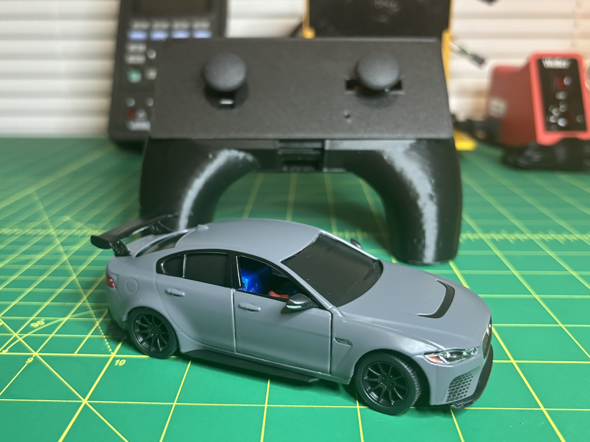
</div>

## Table of Contents
1. [Software Used](#software)
2. [Drive and Steering Control Circuit](#driveandsteeringcircuit)
    - [RF Receiver](#rfreceiver)
    - [Steering Servo Control](#steering)
    - [Drive Motor Control](#drivemotor)
    - [Power Consumption](#powerconsumption)
    - [Charging Notes](#carcharging)
    - [Parts List](#carpartslist)
    - [Schematics](#carschematics)
    - [PCB Images](#carpcbimages)
3. [Remote Control Circuit](#remotecontrolcircuit)
    - [RF Transmitter](#rftransmitter)
    - [Control Input Processing](#controlinputprocessing)
        - [Throttle Input (Left Analog Stick)](#throttleprocessing)
        - [Steering Input (Right Analog Stick)](#steeringprocessing)
    - [Charging Notes](#remotecharging)
    - [Parts List](#remotepartslist)
    - [Schematics](#remoteschematics)
    - [PCB Images](#remotepcbimages)
4. [STL Viewer](#stlviewer)
    - [Car Mechanical Mounts STL](#carmechanicalmountsstl)
    - [Controller Housing STL](#controllerhousingstl)

## 1. Software Used<a name="software"></a>
- VSCode with PlatformIO extension: https://docs.platformio.org/en/latest/what-is-platformio.html
- AVRDUDE (Flash Uploader): https://github.com/avrdudes/avrdude
- KiCad (PCB Design): https://www.kicad.org
- Tinkercad (Controller and parts Design): https://www.tinkercad.com/

## 2. Drive and Steering Control Circuit<a name="driveandsteeringcircuit"></a>
This board is the car's real-time control core. It receives wireless throttle/steering commands from the handheld transmitter, converts steering targets into stable hardware PWM for the MG90S servo, and drives the rear motor through a protected H-bridge path with direction dead-time and command deadbands for smoother behavior. The result is a compact control system designed for responsive handling, predictable failsafe behavior, and reliable power delivery under changing load.

<div align="center">
 <table>
     <tr>
         <td>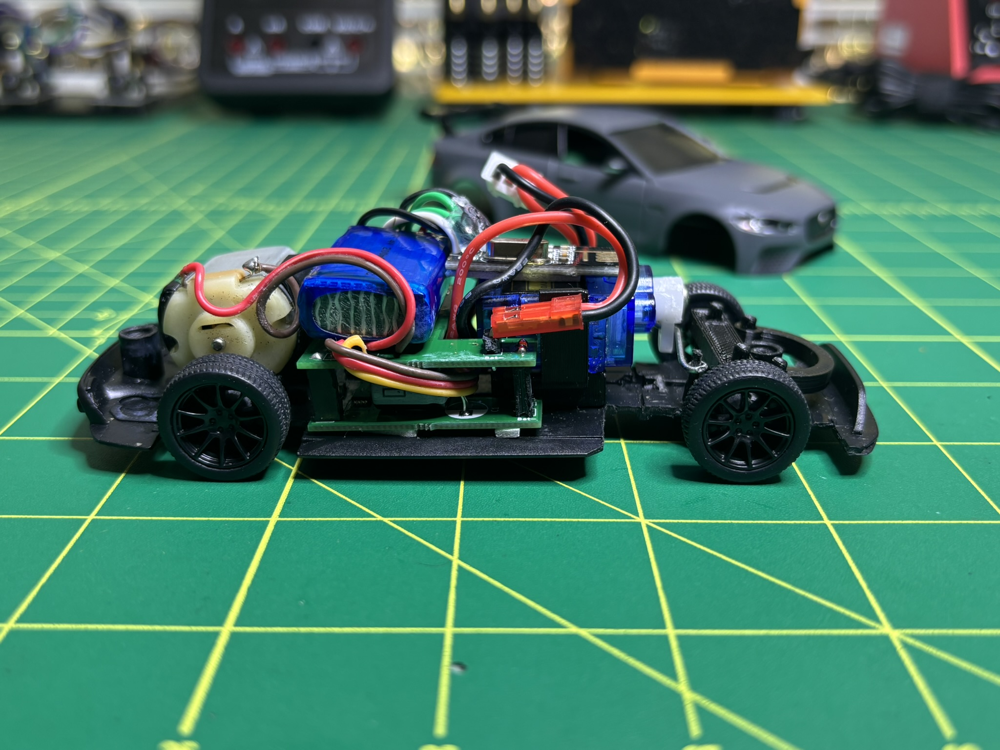</td>
         <td>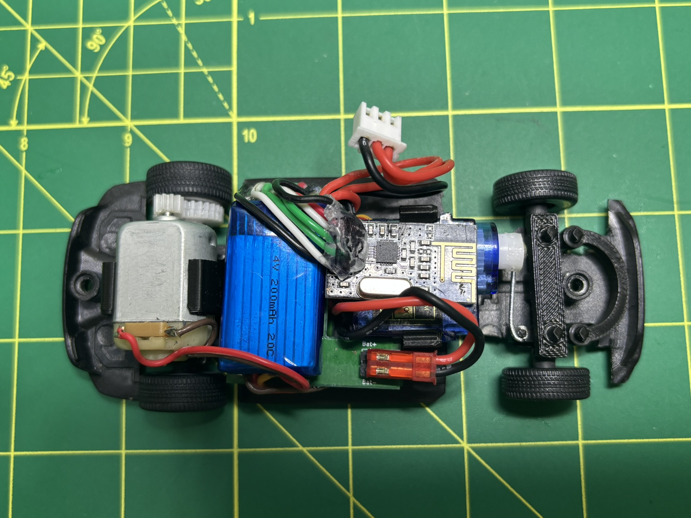</td>
     </tr>
     <tr>
         <td>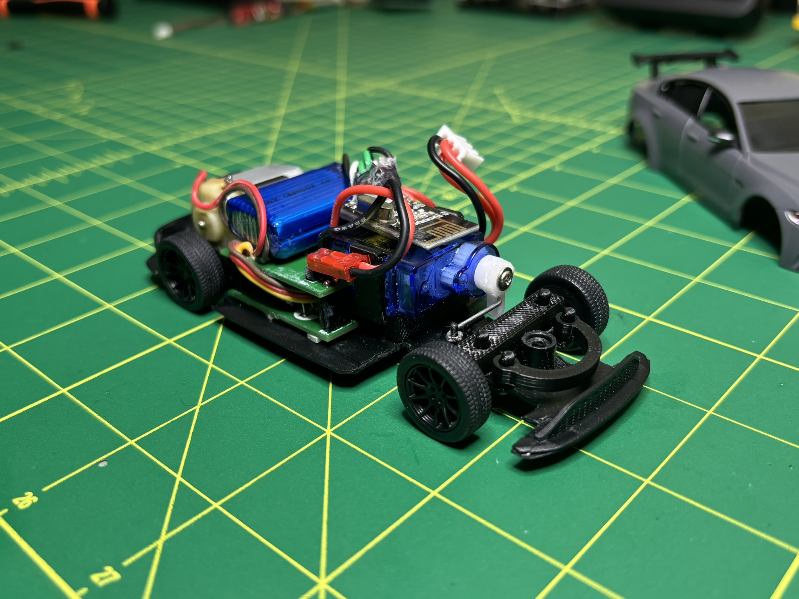</td>
         <td>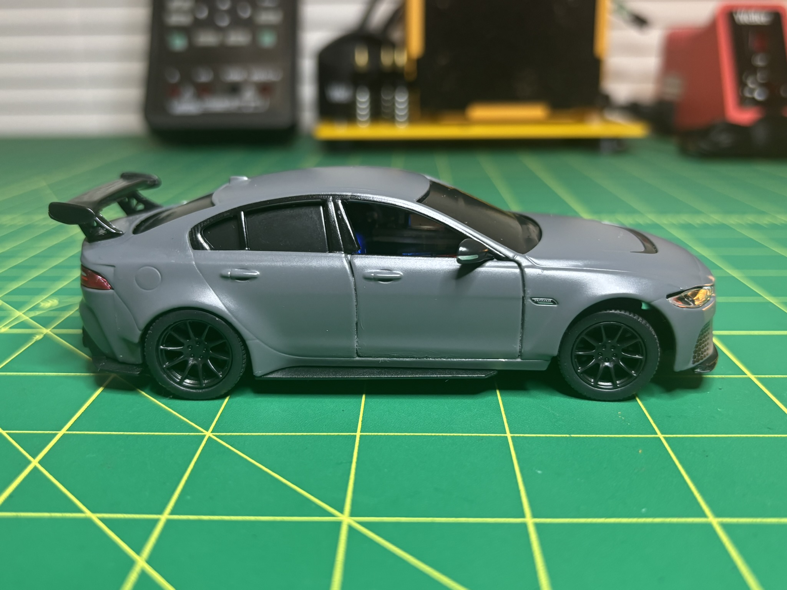</td>
     </tr>
 </table>
</div>

### RF Receiver<a name="rfreceiver"></a>
The car uses an nRF24L01+ module with the RF24 library over SPI to receive drive and steering commands from the handheld controller. In firmware, the radio object is created as `RF24 radio(CE_PIN, CSN_PIN)` with CE on PB0 and CSN on PB1.

The RF stack is configured in `configureRFRadio()` with:

- `radio.begin()` hardware check (halts if radio is not detected)
- `radio.setPALevel(RF24_PA_LOW)` to reduce TX power/current
- `radio.enableDynamicPayloads()`
- `radio.setAutoAck(false)`
- Pipe/address setup using `"jag-1"` and `"jag-2"`
- `radio.startListening()` so this node stays in RX mode

An important part of the RF path is Timer0 timing configuration. Because this firmware includes `#include <RF24.h>`, the RF24 stack depends on `millis()`/`micros()` timing for operations such as CE pulse timing, transmit timing windows, retry timing, and transaction spacing.

The RF24 library itself does not directly configure Timer0. Instead, those timing primitives are provided by the Arduino core (`millis()`/`micros()`), and the project sets Timer0 for a 50 us timing base:

```cpp
TCCR0A = (1 << COM0B1) | (1 << WGM01) | (1 << WGM00);
TCCR0B = (1 << WGM02) | (1 << CS01); // prescaler = 8
OCR0A = 49;
```

At 8 MHz CPU clock with prescaler 8:

- Timer clock = 8 MHz / 8 = 1 MHz
- Timer tick = 1 us
- Period = (49 + 1) x 1 us = 50 us

So the Timer0 event period is 50 us (20 kHz). Timer0 is intentionally kept running at this rate so the `millis()`/`micros()` time base used by RF24 remains available and stable.

The receiver expects a `MotorControlPayload` packet with two fields:

- `int16_t ocrMotor` for signed throttle/drive command
- `uint16_t ocrSteering` for servo pulse width command in microseconds

This payload is 4 bytes total (`2 + 2`), and after reception the car firmware applies it directly:

- `OCR1B = payload.ocrSteering` for steering position
- `payload.ocrMotor` drives H-bridge direction/speed logic with a deadband of -15 to +15

Reliability/safety behavior tied to RF reception:

- On first valid packet, watchdog is enabled (`WDTO_2S`)
- Each additional valid packet resets the watchdog
- If RF packets stop arriving, watchdog timeout forces a reset/failsafe

### Steering Servo Control<a name="steering"></a>
Steering is driven by an MG90S servo using Timer1 hardware PWM on OC1B (PD4). The car firmware configures Timer1 in Fast PWM mode 14 with ICR1 as TOP, prescaler = 8, and ICR1 = 20000. With an 8 MHz clock, that gives a 1 us timer tick and about a 50 Hz control period (20 ms), which matches standard hobby servo timing.

The commanded steering pulse is written directly to OCR1B. Steering values are transmitted as absolute pulse widths in microseconds. Instead of assuming a fixed joystick center, the controller now supports calibration by entering measured joystick potentiometer voltages for minimum, maximum, and center. Those measured values are used to map ADC input to the steering pulse range and produce a more accurate neutral point (typically near 1900 us). On the car side, OCR1B is updated from the payload each loop:

- Neutral: calibrated from measured joystick center voltage (typically ~1900 us)
- Left/Right command range: ~1520 us to ~2280 us
- PWM period: ~20 ms (50 Hz)
- Steering deadzone: +/-90 us around calibrated center snaps to neutral to reduce twitch

This keeps steering response deterministic because the servo waveform is generated in hardware (Timer1), not by software toggling.

### Drive Motor Control<a name="drivemotor"></a>
The drive motor uses a discrete H-bridge driven by a hybrid approach: latch lines select direction, while PWM is generated in software via Timer2 interrupts.

H-bridge signal assignment:

- PC0: Forward latch
- PC1: Forward PWM
- PC2: Reverse latch
- PC3: Reverse PWM

Timer2 is configured for Fast PWM with OCR2A as TOP. With OCR2A = 199 and prescaler = 8 at 8 MHz, PWM frequency is about 5 kHz. Instead of using OC2A/OC2B output pins directly, compare interrupts are used:

- TIMER2_COMPA_vect sets the active direction PWM pin high (PC1 for forward or PC3 for reverse)
- TIMER2_COMPB_vect clears that same active pin low

This effectively creates direction-dependent PWM on one of two output pins while the opposite side remains off.

Direction changes are intentionally staged to protect the bridge and drivetrain:

1. Disable Timer2 PWM (stop switching)
2. Force all H-bridge outputs low
3. Wait 150 ms dead-time
4. Assert new direction latch (PC0 forward or PC2 reverse)
5. Re-enable Timer2 PWM

That delay prevents hard instant reversals and helps ensure MOSFETs on the same side of the H-bridge are not on at the same time during direction transitions, reducing shoot-through/braking stress.

Additional control logic from the car firmware:

- Speed deadband: commands between -15 and +15 stop the motor to avoid joystick/noise creep
- Steering deadzone: commands within +/-90 us of the calibrated center are snapped to neutral
- Direction is only changed when needed (or from stopped state)
- A watchdog is enabled after first RF packet and reset on each valid packet; if RF traffic is lost, the MCU resets after the watchdog timeout (2 s)

### Why RF reception is harder with this PWM approach
Using Timer2 compare interrupts for every PWM cycle means the MCU is servicing frequent interrupts continuously while also polling and reading nRF24 payloads over SPI. That interrupt load can steal time from RF handling and make robust payload reception harder than a pure hardware-PWM motor path.

In practice, the current tuning (about 5 kHz PWM, deadband around zero, staged direction changes) was a workable sweet spot between motor smoothness and reliable radio updates. A strictly hardware PWM implementation for both drive channels would reduce ISR overhead and leave more CPU time for RF processing.

### Power Consumption<a name="powerconsumption"></a>
This power system was sized around worst-case drive events (motor stall plus active steering), not just average cruising current.

Estimated load envelope:

- 9V drive motor stall current at 7.2V: ~600 mA
- MG90S steering servo working current: ~600-700 mA
- Control circuitry (MCU, RF, logic, support electronics): ~20 mA

Worst-case instantaneous estimate:

- Total peak demand: $0.60 + 0.70 + 0.02 \approx 1.32\,A$

Battery capability:

- 2S 200 mAh pack, 20C rating
- Maximum continuous supply: $0.2\,Ah \times 20 = 4\,A$

Power-stage device headroom:

- IRLML6244 continuous drain current: 6.3 A (comfortably above motor stall current)
- IRLML2246 continuous source current: -1.3 A (above the ~600 mA motor stall requirement in this bridge path)

Conclusion: the battery and MOSFET current limits provide practical headroom over the expected peak load, so the system can supply drive, steering, and control electronics simultaneously under normal and transient operation.

### Charging Notes<a name="carcharging"></a>
For safe charging practice on the car side, do not charge the car while it is powered on. Turn the car off first, then connect the charger.

---
### Parts List<a name="carpartslist"></a>
<div align="center">
    <table>
        <tr>
            <td valign="top">
                <table>
                    <tr><th>Part Number</th><th>Quantity</th></tr>
                    <tr><td><a href="https://www.digikey.com/en/products/detail/rubycon/25YXG220MEFC6-3X11/3134189">220uF Capacitor</a></td><td align="center">x1</td></tr>
                    <tr><td><a href="https://www.digikey.com/en/products/detail/taiyo-yuden/TMK107B7105KA-T/2714162">1uF Capacitor</a></td><td align="center">x2</td></tr>
                    <tr><td><a href="https://www.digikey.com/en/products/detail/samsung-electro-mechanics/CL21A106KAYNNNG/3894413">10uF Capacitor</a></td><td align="center">x1</td></tr>
                    <tr><td><a href="https://www.digikey.com/en/products/detail/murata-electronics/GRM188R61E225KA12D/4905349">2.2uF Capacitor</a></td><td align="center">x1</td></tr>
                    <tr><td><a href="https://www.digikey.com/en/products/detail/kemet/C0603C104K3RACTU/416044">.1uF Capacitor</a></td><td align="center">x4</td></tr>
                    <tr><td><a href="https://www.digikey.com/en/products/detail/venkel/CTL1206FRD1T/13245061">LED</a></td><td align="center">x1</td></tr>
                    <tr><td><a href="https://www.digikey.com/en/products/detail/diodes-incorporated/1N5819HW-7-F/814970">1N5819HW-7-F Diode</a></td><td align="center">x4</td></tr>
                    <tr><td><a href="https://www.amazon.com/2-54mm-Breakaway-Female-Connector-Arduino/dp/B01MQ48T2V/ref=sr_1_2_sspa?crid=37UI1XQQ1YOGK&dib=eyJ2IjoiMSJ9.dQRG7A390Cr7G0eECwl3ySotcaXfI28I1uUKHcmiPHf-hvTrpk4-mLxeOfBP_o2wgeNP09ah4l4Z_nh4K_ky6uhpN37tS8i2I8bk7hElYNXx-FAMr_ipA9P94e9JhgRABouD4lHJnLV6bc2VHVILnmQpPnT6LynWmghNohKPKs16E5RMkmBnBZLmoQyECbt8tk0IWHyfDAvT8Id0p6m7HikZdiL1Mb9oZ9zR8lDkjQg.dCZRPJ_88iquw6HqnK28jkzvtgYozecW_lBzuIykXWo&dib_tag=se&keywords=header%2Bpins&qid=1778354973&sprefix=header%2Bpins%2Caps%2C146&sr=8-2-spons&sp_csd=d2lkZ2V0TmFtZT1zcF9hdGY&th=1">Header Pins</a></td><td align="center">x17</td></tr>
                    <tr><td><a href="https://www.digikey.com/en/products/detail/onsemi/MMBT3904LT1G/919601">MMBT3904</a></td><td align="center">x2</td></tr>
                    <tr><td><a href="https://www.digikey.com/en/products/detail/umw/UMWIRLML2246TR/24889419">IRLML2246 / UMWIRLML2246TR</a></td><td align="center">x2</td></tr>
                    <tr><td><a href="https://www.digikey.com/en/products/detail/infineon-technologies/IRLML6244TRPBF/2393871">IRLML6244</a></td><td align="center">x2</td></tr>
                    <tr><td><a href="https://www.digikey.com/en/products/detail/stackpole-electronics-inc/RMCF0603FT470K/1761140">470k ohm Resistor</a></td><td align="center">x1</td></tr>
                    <tr><td><a href="https://www.digikey.com/en/products/detail/yageo/RC0603JR-07510KL/726802">500k ohm Resistor</a></td><td align="center">x1</td></tr>
                    <tr><td><a href="https://www.digikey.com/en/products/detail/koa-speer-electronics-inc/RK73B1JTTD154J/9844780">150k ohm Resistor</a></td><td align="center">x1</td></tr>
                    <tr><td><a href="https://www.digikey.com/en/products/detail/yageo/RC0603JR-071K5L/726689">1.5k ohm Resistor</a></td><td align="center">x1</td></tr>
                    <tr><td><a href="https://www.digikey.com/en/products/detail/stackpole-electronics-inc/RMCF0603JT10K0/1758104">10k ohm Resistor</a></td><td align="center">x5</td></tr>
                </table>
            </td>
            <td width="24"></td>
            <td valign="top">
                <table>
                    <tr><th>Part Number</th><th>Quantity</th></tr>
                    <tr><td><a href="https://www.digikey.com/en/products/detail/yageo/RC0603JR-071K3L/726686">1.3k ohm Resistor</a></td><td align="center">x4</td></tr>
                    <tr><td><a href="https://www.digikey.com/en/products/detail/stackpole-electronics-inc/RMCF0603FT10R0/1761152">10 ohm Resistor</a></td><td align="center">x2</td></tr>
                    <tr><td><a href="https://www.digikey.com/en/products/detail/omron-electronics-inc-emc-div/A6S-1104-PH/3102847">SW_SPST</a></td><td align="center">x1</td></tr>
                    <tr><td><a href="https://www.digikey.com/en/products/detail/texas-instruments/TPS3840DL35DBVR/15857118">TPS3840</a></td><td align="center">x1</td></tr>
                    <tr><td><a href="https://www.digikey.com/en/products/detail/microchip-technology/MIC3975-5-0YMM-TR/1029778">MIC3975-5.0YMM Voltage Regulator</a></td><td align="center">x1</td></tr>
                    <tr><td><a href="https://www.digikey.com/en/products/detail/microchip-technology/MIC5225-3-3YM5-TR/1815447">MIC5225-3.3YM5 Voltage Regulator</a></td><td align="center">x1</td></tr>
                    <tr><td><a href="https://www.digikey.com/en/products/detail/microchip-technology/ATMEGA164A-AU/2271202">ATmega164A-A</a></td><td align="center">x1</td></tr>
                    <tr><td><a href="https://www.amazon.com/dp/B0BWJ4RKGV?ref=ppx_yo2ov_dt_b_fed_asin_title">MG90S servo motor</a></td><td align="center">x1</td></tr>
                    <tr><td><a href="https://www.amazon.com/uxcell-Micro-11500-12000RPM-Remote-Control/dp/B07M99JK6Y/ref=sr_1_6_pp?crid=15ZR5I0IA9JJI&dib=eyJ2IjoiMSJ9.0dTLxilAb6xq-6TUjWUHu4LHY67tPVw3OW_p63iFn0nxHTF8tJOEU3O_Cb8oOwE6WxJZW0BjBXIf0G8GfpGx34Xib0qnggH2QTWBRLxwTrt1dVHrFBr4m3qlymM1dp_HGhddBT5o2u24L-f4An4mHsWxuHhcwAWkuWetTyXovK-j6vw5tc8bw8An9Jwehol9gVoWqmTKBzJJhRpDE5yd1FT2j8fYInDLiEd9pn63in9N35NYOYHjUvUYXkuJJkr2DH7aythkyAL53UUCrgou9nhxGCkFBAQQLPBe2CI7QtI.hByQYkM03NWvQAiFiiVJo0fbgudInFzwV0ohKh8QIlI&dib_tag=se&keywords=9v+motor&qid=1778356523&sprefix=9v+motor%2Caps%2C163&sr=8-6">9V DC Motor</a></td><td align="center">x1</td></tr>
                    <tr><td><a href="https://www.amazon.com/KiNSMART-Jaguar-Project-Metal-Model/dp/B0GXDP3B83/ref=sr_1_2?crid=HY25IPNV0BHN&dib=eyJ2IjoiMSJ9.kNHmPeKKto7l4mN5kOvqBU7R0Xlsnn2LHCeKZya09DTJalbcDjd4JoTcYEG4oBi7Ljllb7X6_TGZSaIGPy1Xm1sebzbI1yp2mHZeyxYMDKpjf4Jqk94GJpw4gnU1N_5tkqw1yrXIqMnX5ZyADOEFBC7UcSktNJJQAYE5tSmkBo9atjGda3yxCk-vgOEnLoZFFx2acgDjpZFOOCdXU92NyMzapczCn7FhwygMaJ_Cei5oG747OONrkMHwEvzIolQ_2xz7kVeILcwJkr2IywmRw9VX98jR5jMxBVIL_H83mhw.naunVJhW78f1ztCTSTYnX7RhDgAuPRFgKA2PJmHRRKo&dib_tag=se&keywords=kinsmart%2B1%3A38&qid=1779063547&sprefix=kinsmart%2B1%2B38%2Caps%2C216&sr=8-2&th=1">Kinsmart Jaguar 1:38</a></td><td align="center">x1</td></tr>
                    <tr><td><a href="https://www.amazon.com/HiLetgo-NRF24L01-Wireless-Transceiver-Module/dp/B00LX47OCY/ref=sr_1_1_sspa?crid=1USO9UOFDEZL5&dib=eyJ2IjoiMSJ9.HpGu4TebgrLEY6IjfmGnCKONGE1zifAy342llWfR4vcsJ4_OTj71wcfjuLFi42g9LnfOsZybnBvz4HCtPFZh7IoO0VCtoV4SHTwJkmzj3SyTmBWTWfYEwK0bZ-6KAhnJqpXuroU3ExNMIQ_0sb6zAw01BAymwhYK7jVncUvl8YxZV7HAVItE-ISceLL5caDSPRu-nl4dzw8eF-t1VvKSdHE_Pz68YolGVn5D4_TDIAE.6OIyGVxp3k88Grsb6QKkfbgzYiEAVdqjkrvRE4yyM6M&dib_tag=se&keywords=nrf24l01&qid=1778356552&sprefix=nrf%2Caps%2C232&sr=8-1-spons&sp_csd=d2lkZ2V0TmFtZT1zcF9hdGY&psc=1">NRF24L01+ Module</a></td><td align="center">x1</td></tr>
                    <tr><td><a href="https://www.amazon.com/dp/B07MW2L96L?ref=ppx_yo2ov_dt_b_fed_asin_title">7.4V battery</a></td><td align="center">x1</td></tr>
                    <tr><td><a href="https://www.amazon.com/200PCS-Module-Plastic-Single-Spindle/dp/B0DKHG96PL/ref=sr_1_6?crid=W0RZLTTF36ZV&dib=eyJ2IjoiMSJ9.rd3Q4coQN-xK_iVME0RsSWQTjAsKta_V4h4vm12weDUJC74fnjatzucJO07yHtkLeIzfxeMC2dxmPiht58xboKdyTAKydnddtAAmDD_aARQfSeJf72BiNVGOLvJEh9z4o6wPQQIsW7IFXJZAsVFzRvb3aBc2lONKzi84gw8UxRRc2rQ9rWUQvz_yelBZoDNSvcFoSqvusfdJFjuKQ47WFcnAPOwQnc2LdEzRRlFGYalz5QPsVB-hWhAqh67OA6riZCc13JSazX8bvwV50yC13BdBVPq8QEGZLQo3CGB_GXM.rLefd6TJ3JQPyoYEO4myNas1mQIUsuXzyBHIw13Vpyw&dib_tag=se&keywords=dc%2Bmotor%2Bgears&qid=1778804461&sprefix=dc%2Bmotor%2Bgear%2Caps%2C142&sr=8-6&th=1">Gears</a></td><td align="center">x1</td></tr>
                    <tr><td><a href="https://www.amazon.com/ruthex-Threaded-Insert-pieces-ultrasound/dp/B088QJG676/ref=sr_1_3?crid=327WC4A3U357H&dib=eyJ2IjoiMSJ9.v_Af1Sv2DMXyynp1rO3uN2cjI_LkHpW2Xd3NuL9RUn1yz2Ym6BTHo47Bnvh-mF3rih3MIxPZyDCFRwN3f8bgTgfOqS-2FD8o-WWmIpuq7XJIrvCSKP6iwhtXO1FB6g2J8vFhgMjuaMVbjKPUpn3U8iuk4FPTnzt9IQcKtjUuxKiJM3PQJf3MPDf15V62fIp3_oibwlJtUKJ7oyWbckn9BPgwhhw0z9gTb7ylLCQjULA.KUBGIt58ag9IJXW2aWAnvHSlQ59y6f_kavaLpQD422E&dib_tag=se&keywords=inserts%2Bm2&qid=1778806075&sprefix=inserts%2Bm%2Caps%2C197&sr=8-3&th=1">M2 Inserts</a></td><td align="center">x3</td></tr>
                    <tr><td><a href="https://www.amazon.com/Phillips-Countersunk-Electronic-Accessories-Samsung/dp/B07HC3LQYS/ref=sr_1_8?crid=2ISFEC45EBS5Q&dib=eyJ2IjoiMSJ9.sToeJ_cHiwrPYQ_C9rq2gwq_BqFxCk_dAqNz8qbKlTKQla66SuHvAVoMEMQE3FrKbT_cXuKk3EDQL7eTiH6WYWt4xdVsIXdoV99uXBCs7qfK_HdB1wotMUmIz4MZM-fYqvCkvNTV6tpBtMOlWfMOOT3xG69H9dmbPd9TCbIKidT_fAgNMZEY2BR0qPmHW3JfhP0KSYKgUQ9dyiHrulr41WxGtIHFVkrdDqeaHCOoUuo.r_V_du0eyowAqg1oQ__QllHDwAeUxV1av7Z4HFjVBKw&dib_tag=se&keywords=m2%2Bscrews&qid=1778806119&sprefix=m2%2Bscrew%2Caps%2C149&sr=8-8&th=1">M2 screws</a></td><td align="center">x3</td></tr>
                </table>
            </td>
        </tr>
    </table>
</div>

### Schematics<a name="carschematics"></a>
<div align="center">
    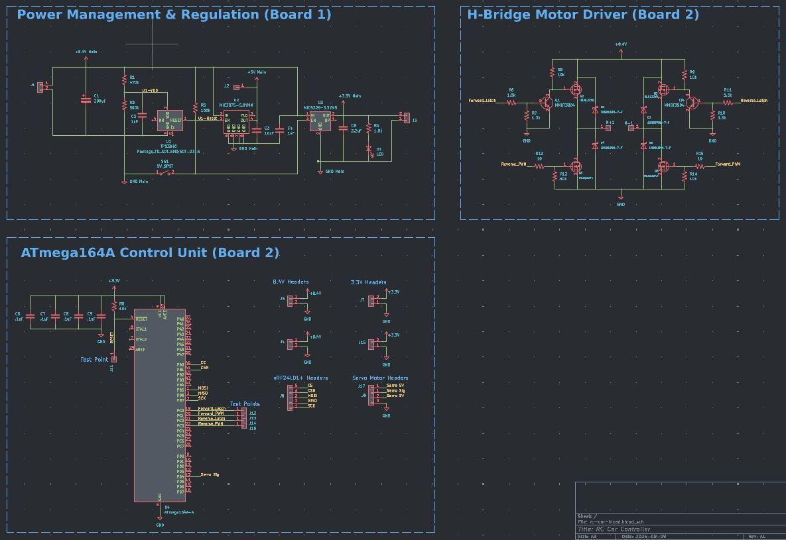
</div>

### PCB Images<a name="carpcbimages"></a>
<div align="center">
 <table>
     <tr>
         <td></td>
         <td>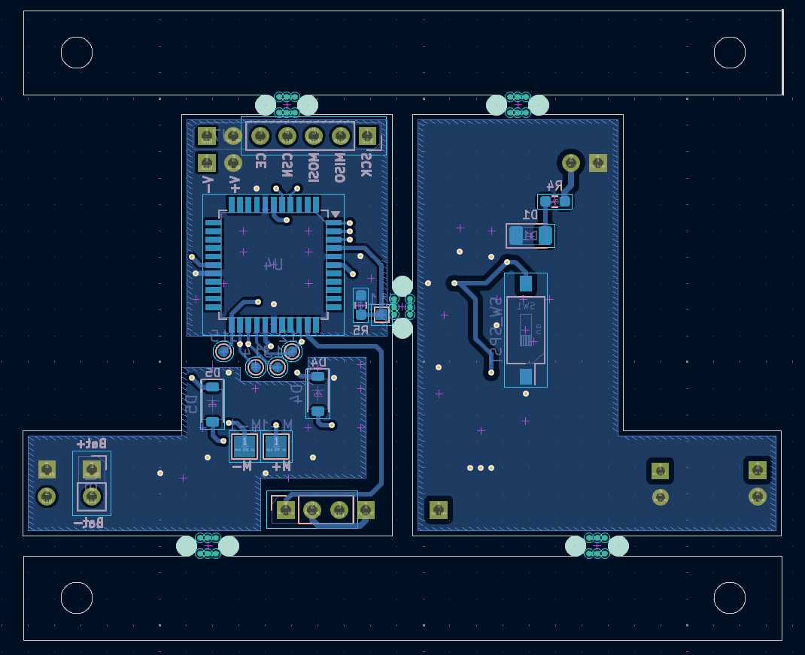</td>
     </tr>
     <tr>
         <td>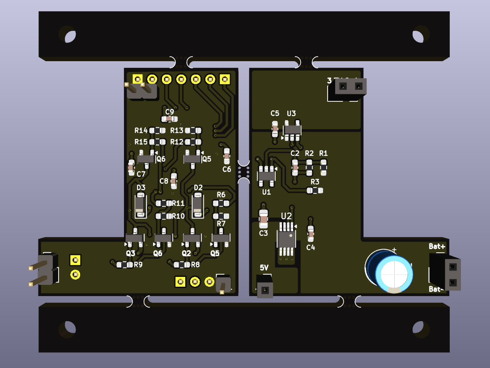</td>
         <td>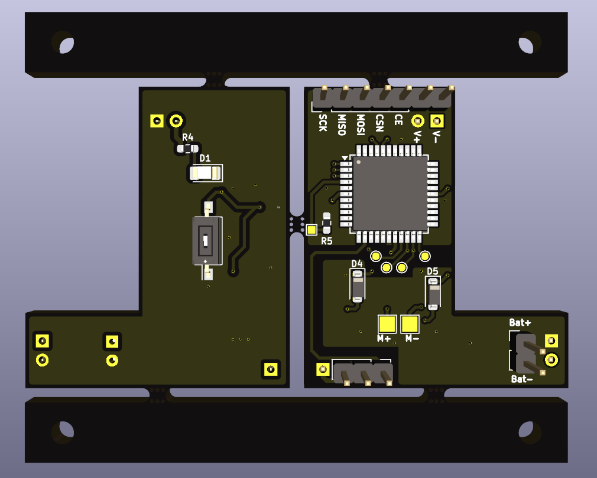</td>
     </tr>
 </table>
</div>

## 3. Remote Control Circuit<a name="remotecontrolcircuit"></a>
The handheld controller samples two joystick axes, converts them into throttle and steering commands, and transmits those values over 2.4 GHz to the car at a steady update rate. The design goal is low-latency control with stable center behavior so the car tracks driver input without twitching or drift.

<div align="center">
 <table>
     <tr>
         <td>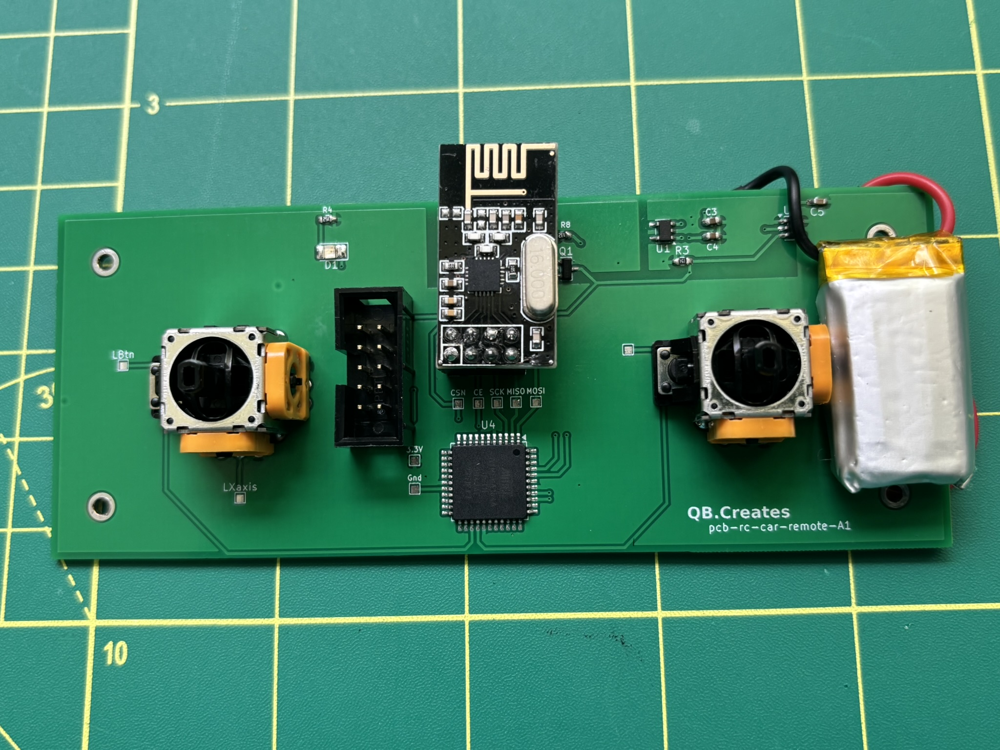</td>
         <td>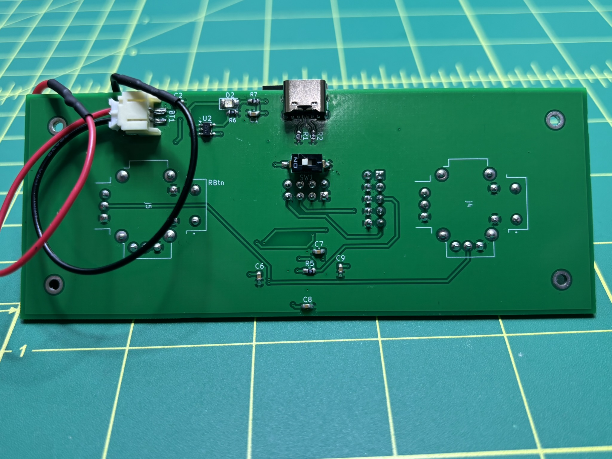</td>
     </tr>
     <tr>
         <td>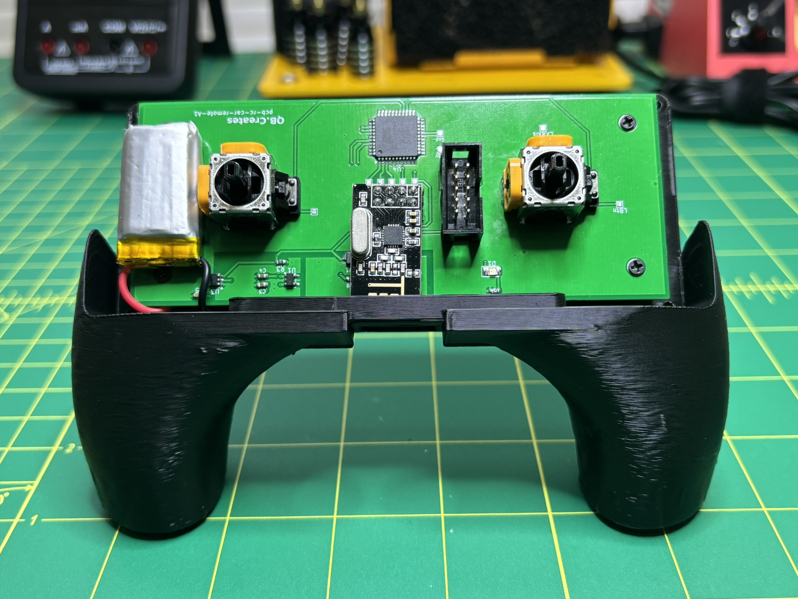</td>
         <td>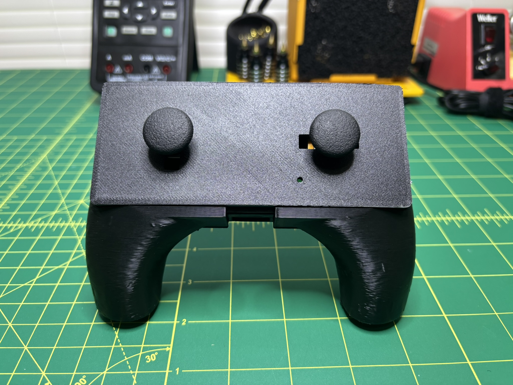</td>
     </tr>
 </table>
</div>

### RF Transmitter<a name="rftransmitter"></a>
The remote uses an nRF24L01+ module with RF24 over SPI to transmit `MotorControlPayload` packets containing `ocrMotor` and `ocrSteering`. During initialization, firmware performs a radio hardware check, configures dynamic payload mode, and sets TX/RX addresses for the paired node. Timer0 is also configured with a 50 us base so the `millis()`/`micros()` timing used by RF24 remains stable while packets are sent continuously.

### Control Input Processing<a name="controlinputprocessing"></a>
Joystick values are read through the ADC and mapped into the exact command domains expected by the vehicle firmware. This preprocessing keeps control semantics consistent across the RF link: signed throttle around zero and steering in absolute pulse-width units centered at a calibrated neutral.

#### Throttle Input (Left Analog Stick)<a name="throttleprocessing"></a>
Throttle is sampled on ADC channel 0, inverted to match intuitive stick direction, scaled into a signed drive command, and centered around zero. Positive values represent forward demand, negative values represent reverse demand, and near-zero commands cooperate with the car-side deadband to prevent idle creep.

#### Steering Input (Right Analog Stick)<a name="steeringprocessing"></a>
Steering is sampled on ADC channel 1 and converted using a calibration profile where measured joystick potentiometer minimum, maximum, and center voltages are entered in firmware. The mapping uses those measured endpoints and center value to generate steering pulses, then clamps to the valid steering window before transmission. This makes neutral alignment and left/right travel more accurate than a fixed center assumption. A center deadzone is applied so small stick jitter and ADC noise snap back to neutral, reducing servo chatter and improving straight-line stability.

### Charging Notes<a name="remotecharging"></a>
The remote has a built-in LiPo charging circuit. When a charger is connected, the controller may automatically power on while charging. You can place the power switch in the OFF position before charging if you prefer it to stay off.

---
### Parts List<a name="remotepartslist"></a>
<div align="center">
    <table>
        <tr>
            <td valign="top">
                <table>
                    <tr><th>Part Number</th><th>Quantity</th></tr>
                    <tr><td><a href="https://www.digikey.com/en/products/detail/jst-sales-america-inc/S2B-PH-SM4-TB/926655">JST Connector</a></td><td align="center">x1</td></tr>
                    <tr><td><a href="https://www.digikey.com/en/products/detail/samsung-electro-mechanics/CL10A475KP8NNNC/3886702">4.7uF Capacitor</a></td><td align="center">x2</td></tr>
                    <tr><td><a href="https://www.digikey.com/en/products/detail/taiyo-yuden/TMK107B7105KA-T/2714162">1uF Capacitor</a></td><td align="center">x2</td></tr>
                    <tr><td><a href="https://www.digikey.com/en/products/detail/murata-electronics/GRM188R61E225KA12D/4905349">2.2uF Capacitor</a></td><td align="center">x1</td></tr>
                    <tr><td><a href="https://www.digikey.com/en/products/detail/kemet/C0603C104K3RACTU/416044">.1uF Capacitor</a></td><td align="center">x4</td></tr>
                    <tr><td><a href="https://www.digikey.com/en/products/detail/venkel/CTL1206FRD1T/13245061">LED</a></td><td align="center">x2</td></tr>
                    <tr><td><a href="https://www.digikey.com/en/products/detail/gct/USB4125-GF-A/13547384">USB_C_Receptacle_USB2.0_14P</a></td><td align="center">x1</td></tr>
                    <tr><td><a href="https://www.digikey.com/en/products/detail/w-rth-elektronik/61201021621/2060590?gclsrc=aw.ds&gad_source=1&gad_campaignid=20234014242&gbraid=0AAAAADrbLliydMvIIXJNX99D3SyONNFow&gclid=CjwKCAjwtvvPBhBuEiwAPMijr9iKDJDvfxlLCPFpasA9r130lziQwH1Oz1Nx0EE10dvVf4E5pzsRdxoCSPkQAvD_BwE">AVR-ISP-10</a></td><td align="center">x1</td></tr>
                    <tr><td><a href="https://www.amazon.com/2-54mm-Breakaway-Female-Connector-Arduino/dp/B01MQ48T2V/ref=sr_1_2_sspa?crid=37UI1XQQ1YOGK&dib=eyJ2IjoiMSJ9.dQRG7A390Cr7G0eECwl3ySotcaXfI28I1uUKHcmiPHf-hvTrpk4-mLxeOfBP_o2wgeNP09ah4l4Z_nh4K_ky6uhpN37tS8i2I8bk7hElYNXx-FAMr_ipA9P94e9JhgRABouD4lHJnLV6bc2VHVILnmQpPnT6LynWmghNohKPKs16E5RMkmBnBZLmoQyECbt8tk0IWHyfDAvT8Id0p6m7HikZdiL1Mb9oZ9zR8lDkjQg.dCZRPJ_88iquw6HqnK28jkzvtgYozecW_lBzuIykXWo&dib_tag=se&keywords=header%2Bpins&qid=1778354973&sprefix=header%2Bpins%2Caps%2C146&sr=8-2-spons&sp_csd=d2lkZ2V0TmFtZT1zcF9hdGY&th=1">nRF24L01+ Headers</a></td><td align="center">x1</td></tr>
                    <tr><td><a href="https://www.amazon.com/Automation-Joysticks-Compatible-Controllers-Precision/dp/B09Y2R1GLV">Joystick B09Y2R1GLV</a></td><td align="center">x2</td></tr>
                    <tr><td><a href="https://www.digikey.com/en/products/detail/infineon-technologies/IRLML6244TRPBF/2393871">IRLML6244</a></td><td align="center">x1</td></tr>
                    <tr><td><a href="https://www.digikey.com/en/products/detail/yageo/RC0603FR-075K1L/727268">5.1k ohm Resistor</a></td><td align="center">x2</td></tr>
                    <tr><td><a href="https://www.digikey.com/en/products/detail/koa-speer-electronics-inc/RK73B1JTTD154J/9844780">150k ohm Resistor</a></td><td align="center">x1</td></tr>
                </table>
            </td>
            <td width="24"></td>
            <td valign="top">
                <table>
                    <tr><th>Part Number</th><th>Quantity</th></tr>
                    <tr><td><a href="https://www.digikey.com/en/products/detail/yageo/RC0603JR-071K5L/726689">1.5k ohm Resistor</a></td><td align="center">x1</td></tr>
                    <tr><td><a href="https://www.digikey.com/en/products/detail/stackpole-electronics-inc/RMCF0603JT10K0/1758104">10k ohm Resistor</a></td><td align="center">x2</td></tr>
                    <tr><td><a href="https://www.digikey.com/en/products/detail/yageo/RC0603FR-07330RL/727162">330 ohm Resistor</a></td><td align="center">x1</td></tr>
                    <tr><td><a href="https://www.digikey.com/en/products/detail/yageo/RC0603JR-071K3L/726686">1.3k ohm Resistor</a></td><td align="center">x1</td></tr>
                    <tr><td><a href="https://www.digikey.com/en/products/detail/omron-electronics-inc-emc-div/A6S-1104-PH/3102847">SW_SPST</a></td><td align="center">x1</td></tr>
                    <tr><td><a href="https://www.digikey.com/en/products/detail/texas-instruments/TPS3840DL35DBVR/15857118">TPS3840</a></td><td align="center">x1</td></tr>
                    <tr><td><a href="https://www.digikey.com/en/products/detail/microchip-technology/MCP73831T-4ADI-OT/1874437?gclsrc=aw.ds&gad_source=1&gad_campaignid=20790518593&gbraid=0AAAAADrbLlgvRBylAxpp-GjrKMif8Czig&gclid=CjwKCAjwtvvPBhBuEiwAPMijr3YD6e-gwd-PDBrTAI6AF4DaDnOhNqFPZpuGwQkKEnNPv-7e_AYXQRoCGHgQAvD_BwE">MCP73831-2-OT</a></td><td align="center">x1</td></tr>
                    <tr><td><a href="https://www.digikey.com/en/products/detail/microchip-technology/MIC5225-3-3YM5-TR/1815447">MIC5225-3.3YM5 Voltage Regulator</a></td><td align="center">x1</td></tr>
                    <tr><td><a href="https://www.digikey.com/en/products/detail/microchip-technology/ATMEGA164A-AU/2271202">ATmega164A-A</a></td><td align="center">x1</td></tr>
                    <tr><td><a href="https://www.amazon.com/HiLetgo-NRF24L01-Wireless-Transceiver-Module/dp/B00LX47OCY/ref=sr_1_1_sspa?crid=1USO9UOFDEZL5&dib=eyJ2IjoiMSJ9.HpGu4TebgrLEY6IjfmGnCKONGE1zifAy342llWfR4vcsJ4_OTj71wcfjuLFi42g9LnfOsZybnBvz4HCtPFZh7IoO0VCtoV4SHTwJkmzj3SyTmBWTWfYEwK0bZ-6KAhnJqpXuroU3ExNMIQ_0sb6zAw01BAymwhYK7jVncUvl8YxZV7HAVItE-ISceLL5caDSPRu-nl4dzw8eF-t1VvKSdHE_Pz68YolGVn5D4_TDIAE.6OIyGVxp3k88Grsb6QKkfbgzYiEAVdqjkrvRE4yyM6M&dib_tag=se&keywords=nrf24l01&qid=1778356552&sprefix=nrf%2Caps%2C232&sr=8-1-spons&sp_csd=d2lkZ2V0TmFtZT1zcF9hdGY&psc=1">NRF24L01+ Module</a></td><td align="center">x1</td></tr>
                    <tr><td><a href="https://www.amazon.com/EEMB-Rechargeable-Connector-Parrott-Polarity/dp/B0B7R8CS2C/ref=sr_1_9?crid=2PNJXHT8O2BD7&dib=eyJ2IjoiMSJ9.ytY0ATgoZUTp8fkKfIbFwxfJ-RPFGOh8Fljs3SALwOdc0E5um9MqwU3Nf561TyqW5eWp_bfODQRFYKAYV0HQlPTNrv5PexF4DVU2RbBdxKcuSmBcDQuw5ImA3T8MQCieUYtHxHjlPQKIey3tmjioRLIZljCtEmJfrXf2yw62FtfaherhM4QZP-lGmU_qZ4IiXu3H0jwThQ-BqoBcTMGELR8DD_BVenflcsgEmfo4edXbIZRGZtWTI9cXMjF2NkhywL7GquoxWDFoC_LZDs7lVysMe3o4p0KdNnO_wNiqgRM.z8oLo5uD7M9zWKGX-XX1qytnO6Q6kw132uBizXV_u2c&dib_tag=se&keywords=250ma+hour+lipo+battery&qid=1779063612&sprefix=250ma+hour+lipo+battery%2Caps%2C142&sr=8-9">3.7v batter</a></td><td align="center">x1</td></tr>
                    <tr><td><a href="https://www.amazon.com/ruthex-Threaded-Insert-pieces-ultrasound/dp/B088QJG676/ref=sr_1_3?crid=327WC4A3U357H&dib=eyJ2IjoiMSJ9.v_Af1Sv2DMXyynp1rO3uN2cjI_LkHpW2Xd3NuL9RUn1yz2Ym6BTHo47Bnvh-mF3rih3MIxPZyDCFRwN3f8bgTgfOqS-2FD8o-WWmIpuq7XJIrvCSKP6iwhtXO1FB6g2J8vFhgMjuaMVbjKPUpn3U8iuk4FPTnzt9IQcKtjUuxKiJM3PQJf3MPDf15V62fIp3_oibwlJtUKJ7oyWbckn9BPgwhhw0z9gTb7ylLCQjULA.KUBGIt58ag9IJXW2aWAnvHSlQ59y6f_kavaLpQD422E&dib_tag=se&keywords=inserts%2Bm2&qid=1778806075&sprefix=inserts%2Bm%2Caps%2C197&sr=8-3&th=1">M2 Inserts</a></td><td align="center">x10</td></tr>
                    <tr><td><a href="https://www.amazon.com/Phillips-Countersunk-Electronic-Accessories-Samsung/dp/B07HC3LQYS/ref=sr_1_8?crid=2ISFEC45EBS5Q&dib=eyJ2IjoiMSJ9.sToeJ_cHiwrPYQ_C9rq2gwq_BqFxCk_dAqNz8qbKlTKQla66SuHvAVoMEMQE3FrKbT_cXuKk3EDQL7eTiH6WYWt4xdVsIXdoV99uXBCs7qfK_HdB1wotMUmIz4MZM-fYqvCkvNTV6tpBtMOlWfMOOT3xG69H9dmbPd9TCbIKidT_fAgNMZEY2BR0qPmHW3JfhP0KSYKgUQ9dyiHrulr41WxGtIHFVkrdDqeaHCOoUuo.r_V_du0eyowAqg1oQ__QllHDwAeUxV1av7Z4HFjVBKw&dib_tag=se&keywords=m2%2Bscrews&qid=1778806119&sprefix=m2%2Bscrew%2Caps%2C149&sr=8-8&th=1">M2 Screws</a></td><td align="center">x10</td></tr>
                </table>
            </td>
        </tr>
    </table>
</div>

### Schematics<a name="remoteschematics"></a>
<div align="center">
    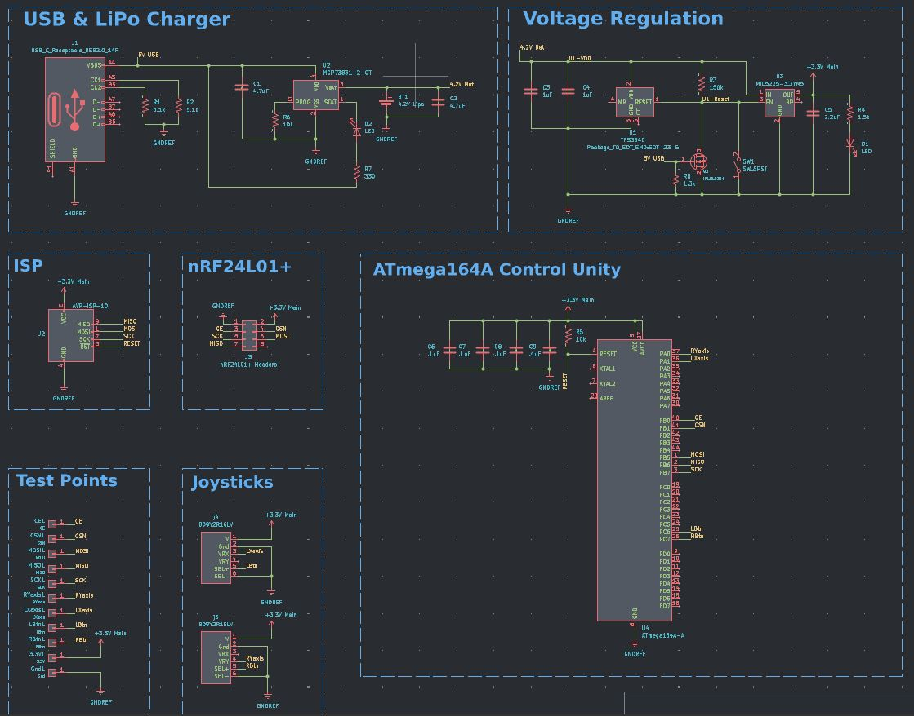
</div>

### PCB Images<a name="remotepcbimages"></a>
<div align="center">
 <table>
     <tr>
         <td>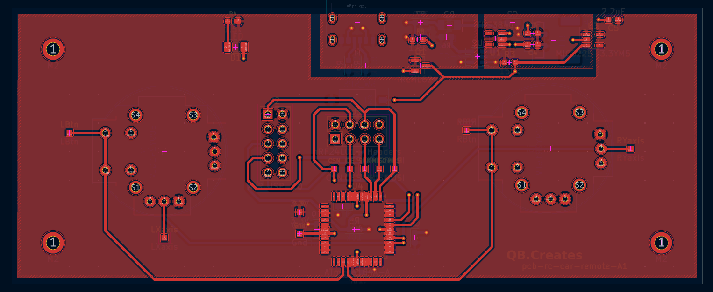</td>
         <td>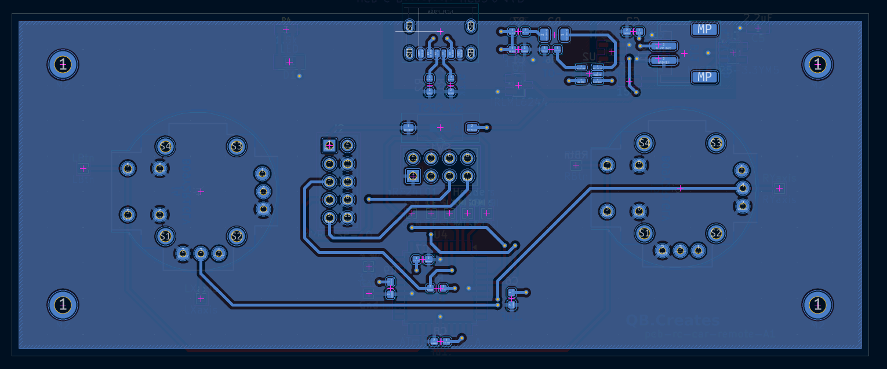</td>
     </tr>
     <tr>
         <td>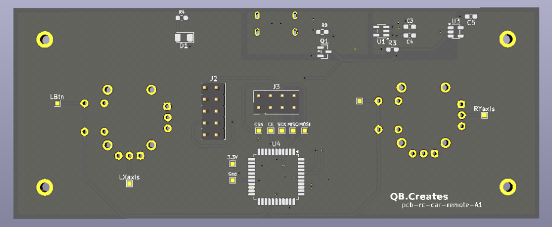</td>
         <td>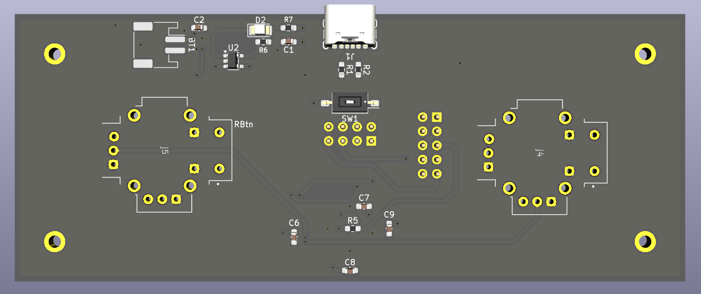</td>
     </tr>
 </table>
</div>

## 4. STL Viewer <a name="stlviewer"></a>
### Car Mechanical Mounts STL <a name="carmechanicalmountsstl"></a>
- [Car Parts.stl](3d%20print/Car%20Parts.stl)

### Controller Housing STL <a name="controllerhousingstl"></a>
- [Controller.stl](3d%20print/Controller.stl)

---

### Schematics & PCB
Schematic and PCB files are available in the `eda/rc-car-kicad/` directory. Example files:
- `rc-car-kicad.kicad_sch` – Main schematic
- `rc-car-kicad.kicad_pcb` – Main PCB layout
- `rc-car-panel.kicad_pcb` – Panelized PCB for manufacturing

---

## License
See [LICENSE](LICENSE) for details.
